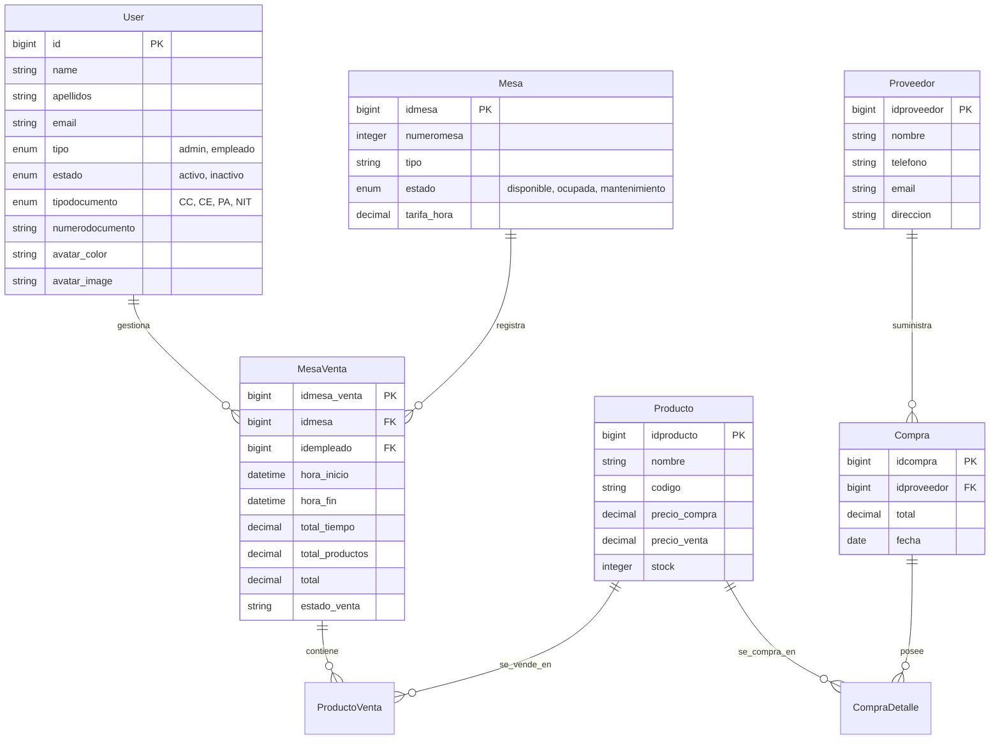

# 🎱 BILLAR NEXUS — Sistema Integral de Gestión para Billares

<p align="center">
  
  
  
  
  
  
</p>

---

## 📌 Descripción General

**Billar Nexus** es una plataforma web centralizada y de alto rendimiento diseñada para la administración integral de establecimientos de billar. Permite gestionar con precisión el control de tiempo en mesas, ventas de consumo en tiempo real, inventarios, compras a proveedores, métricas de rendimiento y administración de personal mediante un esquema de seguridad basado en roles.

El sistema está construido sobre **Laravel 11**, con una interfaz moderna y responsiva basada en **AdminLTE 3**, **TailwindCSS** y **Chart.js**, preparado para ser desplegado sobre infraestructura en la nube (**Oracle Cloud Infrastructure / Docker**).

---

## 🔥 Funcionalidades Principales

### 🎱 1. Gestión de Mesas y Control de Tiempo
- **Control de Tiempo en Vivo**: Registro automático de hora de inicio, finalización y tiempo transcurrido por mesa.
- **Tipos de Mesas & Tarifas**: Configuración de mesas por categoría (Pool, Tres Bandas, Libre, VIP) con tarifas por hora personalizables.
- **Gestión de Estados**: Alternancia entre estados en tiempo real (*Disponible*, *Ocupada*, *Mantenimiento*).
- **Control de Sesión**: Operaciones complejas para *Iniciar*, *Pausar*, *Finalizar*, *Reiniciar* y *Cerrar* cuenta de mesa.
- **Consumo Integrado**: Adición directa de productos y bebidas a la partida activa de la mesa antes del cierre de caja.

### 🍺 2. Productos e Inventario
- **Catálogo de Productos**: Control de artículos por nombre, código/código de barras, categoría y unidad de medida.
- **Precios & Márgenes**: Gestión de precio de compra vs. precio de venta para cálculo de utilidades.
- **Control de Stock en Tiempo Real**: Descuento automático de existencias con las ventas y alertas de bajo inventario.
- **Métricas de Rotación**: Consulta del **Top 5 productos más vendidos** mediante API optimizada.

### 🚚 3. Compras y Proveedores
- **Directorio de Proveedores**: Registro detallado de información de contacto, documentos y representantes.
- **Órdenes de Surtido & Compras**: Registro de facturas e ingresos de mercancía con detalle por producto y precio de costo.
- **Actualización Automatizada**: Incremento automático de inventario al registrar una compra exitosa.
- **Historial de Abastecimiento**: Registro auditable de compras realizadas por proveedor y periodo.

### 💳 4. Ventas y Facturación de Caja
- **Ticket Consolidado**: Cálculo automático de la suma entre el valor consumido por tiempo de mesa y los productos consumidos.
- **Múltiples Métodos de Pago**: Registro de pagos en efectivo, transferencias bancarias y tarjetas.
- **Historial Completo de Ventas**: Consulta de ventas finalizadas con filtros por fecha y mesa.
- **Eliminación y Ajustes**: Control para eliminar o rectificar productos cargados a una mesa antes de procesar el pago.

### 📊 5. Dashboard Administrativo (Panel en Tiempo Real)
- **Indicadores Clave (KPIs)**:
  - Ingresos generados durante el día (Zona horaria América/Bogotá).
  - Ocupación de mesas en tiempo real (*Ocupadas vs Total*).
  - Cantidad total de productos en catálogo.
- **Gráficos Interactivos**: Ventas acumuladas de la semana desglosadas por día mediante **Chart.js**.
- **Accesos Rápidos**: Botones funcionales a la gestión directa de mesas y ventas.

### 📈 6. Informes y Business Intelligence (BI)
- **Reporte de Ventas**: Análisis de ingresos por rango de fechas y periodos.
- **Productos Más Vendidos**: Clasificación y volumen de ventas por artículo.
- **Ingresos por Método de Pago**: Distribución porcentual entre efectivo, transferencias y tarjetas.
- **Tasa de Ocupación de Mesas**: Estadísticas de uso e intensidad de alquiler por mesa.
- **Comparativa Mensual**: Análisis comparativo de ingresos mes a mes.
- **Analítica de Compras**: Resumen de gastos de abastecimiento por proveedor y por producto adquirido.

### 👤 7. Gestión de Usuarios, Roles y Seguridad
- **Control de Acceso Basado en Roles (RBAC)**:
  - **Administrador (`admin`)**: Acceso total al sistema, configuraciones, informes, compras y gestión de personal.
  - **Empleado (`empleado`)**: Acceso a la operación diaria de mesas, registro de ventas y consumos.
- **Flujo de Aprobación de Registro**: Los nuevos usuarios registrados quedan en estado `inactivo` hasta que un administrador apruebe su cuenta.
- **Panel de Gestión de Usuarios**: Cambio rápido de estado (*Activo/Inactivo*) y rol (*Admin/Empleado*).
- **Perfil de Usuario Avanzado**:
  - Edición de información personal y documento de identidad (CC, CE, PA, NIT).
  - Cambio seguro de contraseña con validación en tiempo real.
  - Personalización de avatar (color de fondo dinámico o subida de imagen de perfil).
  - Zona de peligro para eliminación segura de cuenta con doble confirmación.

---

## 🛠️ Stack Tecnológico

| Capa | Tecnología / Herramienta |
| :--- | :--- |
| **Backend** | PHP 8.2+, Laravel 11.x, Eloquent ORM |
| **Frontend** | Blade Templates, AdminLTE 3.2, TailwindCSS 3, FontAwesome 5 |
| **Visualización & JS** | Chart.js, Axios, Vite, JavaScript ES6+ |
| **Base de Datos** | MySQL 8.0 (Dockerizado) |
| **Infraestructura Cloud** | Oracle Cloud Infrastructure (OCI) — Ubuntu Linux |
| **Contenedores** | Docker & Docker Compose |
| **Pruebas** | PHPUnit / Pest PHP |

---

## 🗄️ Arquitectura de Base de Datos

El sistema utiliza modelos Eloquent estructurados bajo el estándar **Singular PascalCase**:



---

## 🚀 Guía de Instalación y Configuración Local

### Requisitos Previos
- **PHP** >= 8.2 con extensiones `pdo_mysql`, `mbstring`, `openssl`, `bcmath`, `curl`.
- **Composer** >= 2.x
- **Node.js** >= 18.x & **npm**
- **MySQL** >= 8.0 o **Docker Desktop**

### Pasos de Instalación

1. **Clonar el repositorio**:
   ```bash
   git clone https://github.com/jhormanf26/copia-sistema-billar.git
   cd PROYECTO-BILLAR-main
   ```

2. **Instalar dependencias de PHP**:
   ```bash
   composer install
   ```

3. **Instalar dependencias Frontend & Compilar Assets**:
   ```bash
   npm install
   npm run build
   # Para desarrollo activo: npm run dev
   ```

4. **Configurar el archivo de entorno**:
   ```bash
   cp .env.example .env
   php artisan key:generate
   ```

5. **Configurar la Base de Datos en `.env`**:
   ```env
   DB_CONNECTION=mysql
   DB_HOST=127.0.0.1
   DB_PORT=3306
   DB_DATABASE=billar_db
   DB_USERNAME=root
   DB_PASSWORD=
   ```

6. **Ejecutar Migraciones y Datos de Prueba (Seeders)**:
   ```bash
   php artisan migrate --seed
   ```

7. **Crear el enlace simbólico para almacenamiento de avatares**:
   ```bash
   php artisan storage:link
   ```

8. **Iniciar el Servidor Local**:
   ```bash
   php artisan serve
   ```
   Accede a la aplicación en `http://localhost:8000`.

---

## 🔑 Credenciales de Acceso por Defecto

Tras ejecutar los seeders, se disponen de las siguientes cuentas predeterminadas:

| Rol | Email | Contraseña | Descripción |
| :--- | :--- | :--- | :--- |
| **Administrador** | `admin@admin.com` | `admin123` | Acceso total a todas las secciones del sistema |
| **Desarrollo / Admin** | `a@a.a` | `12345678` | Cuenta alternativa de administración |

> [!IMPORTANT]
> Los usuarios registrados desde la pantalla pública (`/register`) quedan en estado **Inactivo** hasta que un Administrador los active manualmente desde `/usuarios`.

---

## 🐳 Despliegue en Servidor Cloud (Oracle Cloud & Docker)

El proyecto incluye soporte listo para producción en Oracle Cloud (Ubuntu) con base de datos en Docker.

### Comandos para Gestión de Docker (`docker-compose.yml`)

```bash
# Iniciar contenedor MySQL en segundo plano
docker-compose up -d

# Consultar logs del servicio en vivo
docker-compose logs -f

# Detener contenedor
docker-compose down
```

#### Especificaciones del Contenedor MySQL
- **Contenedor**: `billar-db`
- **Límite RAM**: `512MB`
- **Límite CPU**: `0.5` cores (50% de 1 core)

---

## 🧪 Pruebas Unitarias y de Integración

Para ejecutar la suite de pruebas del proyecto:

```bash
# Ejecutar todas las pruebas con PHPUnit / Pest
php artisan test

# Filtrar pruebas específicas (ej. Perfil o Autenticación)
php artisan test --filter ProfileTest
```

---

## 📚 Documentación Adicional

- 📄 [Guía de Despliegue en la Nube](DOCS/DEPLOYMENT_GUIDE.md)
- 📄 [Estándares de Código y Refactorización](DOCS/PROJECT_STANDARDS.md)
- 📄 [Guía de Acceso y Credenciales](DOCS/USER_ACCESS.md)

---

## 📄 Licencia

Este proyecto está bajo la licencia **MIT**. Consulta el archivo `LICENSE` para más detalles.
